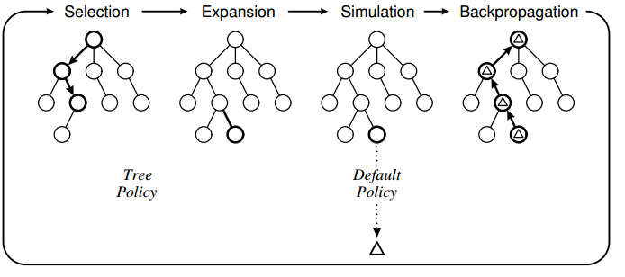

# Awesome Monte Carlo Tree Search Papers.
    

  

-----------------------------------------------

A curated list of Monte Carlo tree search papers with implementations from the following conferences/journals:

- Machine learning
   * [NeurIPS](https://nips.cc/)
   * [ICML](https://icml.cc/)
- Computer vision
   * [CVPR](http://cvpr2019.thecvf.com/)
   * [ICCV](http://iccv2019.thecvf.com/)
- Natural language processing
   * [ACL](http://www.acl2019.org/EN/index.xhtml)
- Data
   * [KDD](https://www.kdd.org/)
- Artificial intelligence
   * [AAAI](https://www.aaai.org/)
   * [AISTATS](https://www.aistats.org/)
   * [IJCAI](https://www.ijcai.org/)
   * [UAI](http://www.auai.org/)
- Robotics
   * [RAS](https://www.journals.elsevier.com/robotics-and-autonomous-systems)
- Games
   * [CIG](http://www.ieee-cig.org/)

Similar collections about [graph classification](https://github.com/benedekrozemberczki/awesome-graph-classification), [gradient boosting](https://github.com/benedekrozemberczki/awesome-gradient-boosting-papers), [classification/regression trees](https://github.com/benedekrozemberczki/awesome-decision-tree-papers), [fraud detection](https://github.com/benedekrozemberczki/awesome-fraud-detection-papers), and [community detection](https://github.com/benedekrozemberczki/awesome-community-detection) papers with implementations.

## 2021

- **Learning to Stop: Dynamic Simulation Monte-Carlo Tree Search (AAAI 2021)**
  - Li-Cheng Lan, Ti-Rong Wu, I-Chen Wu, Cho-Jui Hsieh
  - [[Paper]](https://arxiv.org/abs/2012.07910)

- **Dec-SGTS: Decentralized Sub-Goal Tree Search for Multi-Agent Coordination (AAAI 2021)**
  - Minglong Li, Zhongxuan Cai, Wenjing Yang, Lixia Wu, Yinghui Xu, Ji Wang
  - [[Paper]](https://ojs.aaai.org/index.php/AAAI/article/view/17345)

- **Improved POMDP Tree Search Planning with Prioritized Action Branching (AAAI 2021)**
  - John Mern, Anil Yildiz, Lawrence Bush, Tapan Mukerji, Mykel J. Kochenderfer
  - [[Paper]](https://arxiv.org/abs/2010.03599)

- **Dynamic Automaton-Guided Reward Shaping for Monte Carlo Tree Search (AAAI 2021)**
  - Alvaro Velasquez, Brett Bissey, Lior Barak, Andre Beckus, Ismail Alkhouri, Daniel Melcer, George K. Atia
  - [[Paper]](https://ojs.aaai.org/index.php/AAAI/article/view/17427)

- **Single Player Monte-Carlo Tree Search Based on the Plackett-Luce Model (AAAI 2021)**
  - Felix Mohr, Viktor Bengs, Eyke Hüllermeier
  - [[Paper]](https://ojs.aaai.org/index.php/AAAI/article/view/17468)

- **Learning to Pack: A Data-Driven Tree Search Algorithm for Large-Scale 3D Bin Packing Problem (CIKM 2021)**
  - Qianwen Zhu, Xihan Li, Zihan Zhang, Zhixing Luo, Xialiang Tong, Mingxuan Yuan, Jia Zeng
  - [[Paper]](https://dl.acm.org/doi/abs/10.1145/3459637.3481933)

- **Practical Massively Parallel Monte-Carlo Tree Search Applied to Molecular Design (ICLR 2021)**
  - Xiufeng Yang, Tanuj Kr Aasawat, Kazuki Yoshizoe
  - [[Paper]](https://arxiv.org/abs/2006.10504)

- **Convex Regularization in Monte-Carlo Tree Search (ICML 2021)**
  - Tuan Dam, Carlo D'Eramo, Jan Peters, Joni Pajarinen
  - [[Paper]](https://arxiv.org/abs/2007.00391)

- **Combining Tree Search and Action Prediction for State-of-the-Art Performance in DouDiZhu (IJCAI 2021)**
  - Yunsheng Zhang, Dong Yan, Bei Shi, Haobo Fu, Qiang Fu, Hang Su, Jun Zhu, Ning Chen
  - [[Paper]](https://www.ijcai.org/proceedings/2021/470)

## 2020

- **Monte Carlo Tree Search in Continuous Spaces Using Voronoi Optimistic Optimization with Regret Bounds (AAAI 2020)**
  - Beomjoon Kim, Kyungjae Lee, Sungbin Lim, Leslie Pack Kaelbling, Tomás Lozano-Pérez
  - [[Paper]](https://www.aaai.org/Papers/AAAI/2020GB/AAAI-KimB.1282.pdf)

- **Neural Architecture Search Using Deep Neural Networks and Monte Carlo Tree Search (AAAI 2020)**
  - Linnan Wang, Yiyang Zhao, Yuu Jinnai, Yuandong Tian, Rodrigo Fonseca
  - [[Paper]](https://arxiv.org/abs/1805.07440)
  - [[Code]](https://github.com/linnanwang/AlphaX-NASBench101)

- **Monte-Carlo Tree Search in Continuous Action Spaces with Value Gradients (AAAI 2020)**
  - Jongmin Lee, Wonseok Jeon, Geon-Hyeong Kim, Kee-Eung Kim
  - [[Paper]](https://www.ijcai.org/Proceedings/16/Papers/104.pdf)
  - [[Code]](https://github.com/leekwoon/KR-DL-UCT)
  
- **Approximate Inference in Discrete Distributions with Monte Carlo Tree Search and Value Functions (AISTATS 2020)**
  - Lars Buesing, Nicolas Heess, Theophane Weber
  - [[Paper]](https://arxiv.org/abs/1910.06862)

- **Watch the Unobserved: A Simple Approach to Parallelizing Monte Carlo Tree Search (ICLR 2020)**
  - Anji Liu, Jianshu Chen, Mingze Yu, Yu Zhai, Xuewen Zhou, Ji Liu
  - [[Paper]](https://openreview.net/forum?id=BJlQtJSKDB)
  - [[Code]](https://github.com/brilee/python_uct)
  
- **Information Particle Filter Tree: An Online Algorithm for POMDPs with Belief-Based Rewards on Continuous Domains (ICML 2020)**
  - Johannes Fischer, Ömer Sahin Tas
  - [[Paper]](http://proceedings.mlr.press/v119/fischer20a.html)
  - [[Code]](https://github.com/johannes-fischer/icml2020_ipft)

- **Sub-Goal Trees a Framework for Goal-Based Reinforcement Learning (ICML 2020)**
  - Tom Jurgenson, Or Avner, Edward Groshev, Aviv Tamar
  - [[Paper]](https://arxiv.org/abs/2002.12361)
  
- **Monte-Carlo Tree Search for Scalable Coalition Formation (IJCAI 2020)**
  - Feng Wu, Sarvapali D. Ramchurn
  - [[Paper]](https://www.ijcai.org/Proceedings/2020/57)

- **Generalized Mean Estimation in Monte-Carlo Tree Search (IJCAI 2020)**
  - Tuan Dam, Pascal Klink, Carlo D'Eramo, Jan Peters, Joni Pajarinen
  - [[Paper]](https://arxiv.org/abs/1911.00384)

- **Sparse Tree Search Optimality Guarantees in POMDPs with Continuous Observation Spaces (IJCAI 2020)**
  - Michael H. Lim, Claire Tomlin, Zachary N. Sunberg
  - [[Paper]](https://arxiv.org/abs/1910.04332)
  
- **Mix and Match: An Optimistic Tree-Search Approach for Learning Models from Mixture Distributions (NeurIPS 2020)**
  - Matthew Faw, Rajat Sen, Karthikeyan Shanmugam, Constantine Caramanis, Sanjay Shakkottai
  - [[Paper]](https://arxiv.org/abs/1907.10154)

- **Extracting Knowledge from Web Text with Monte Carlo Tree Search (WWW 2020)**
  - Guiliang Liu, Xu Li, Jiakang Wang, Mingming Sun, Ping Li
  - [[Paper]](https://dl.acm.org/doi/abs/10.1145/3366423.3380010)

## 2019
- **ACE: An Actor Ensemble Algorithm for Continuous Control with Tree Search (AAAI 2019)**
  - Shangtong Zhang, Hengshuai Yao
  - [[Paper]](https://arxiv.org/abs/1811.02696)
  - [[Code]](https://github.com/ShangtongZhang/DeepRL)

- **A Monte Carlo Tree Search Player for Birds of a Feather Solitaire (AAAI 2019)**
  - Christian Roberson, Katarina Sperduto
  - [[Paper]](https://aaai.org/ojs/index.php/AAAI/article/view/5036)
  - [[Code]](http://cs.gettysburg.edu/~tneller/puzzles/boaf/)

- **Vine Copula Structure Learning via Monte Carlo Tree Search (AISTATS 2019)**
  - Bo Chang, Shenyi Pan, Harry Joe
  - [[Paper]](http://proceedings.mlr.press/v89/chang19a/chang19a.pdf)
  - [[Code]](https://github.com/changebo/Vine_MCTS)

- **Noisy Blackbox Optimization using Multi-fidelity Queries: A Tree Search Approach (AISTATS 2019)**
  - Rajat Sen, Kirthevasan Kandasamy, Sanjay Shakkottai
  - [[Paper]](https://arxiv.org/abs/1810.10482)
  - [[Code]](https://github.com/rajatsen91/MFTREE_DET)

- **Reinforcement Learning Based Monte Carlo Tree Search for Temporal Path Discovery (ICDM 2019)**
  - Pengfei Ding, Guanfeng Liu, Pengpeng Zhao, An Liu, Zhixu Li, Kai Zheng
  - [[Paper]](https://zheng-kai.com/paper/icdm_2019_b.pdf)

- **Monte Carlo Tree Search for Policy Optimization (IJCAI 2019)**
  - Xiaobai Ma, Katherine Rose Driggs-Campbell, Zongzhang Zhang, Mykel J. Kochenderfer
  - [[Paper]](https://www.ijcai.org/proceedings/2019/0432.pdf)

- **Subgoal-Based Temporal Abstraction in Monte-Carlo Tree Search (IJCAI 2019)**
  - Thomas Gabor, Jan Peter, Thomy Phan, Christian Meyer, Claudia Linnhoff-Popien
  - [[Paper]](https://www.ijcai.org/proceedings/2019/0772.pdf)
  - [[Code]](https://github.com/jnptr/subgoal-mcts)

- **Automated Machine Learning with Monte-Carlo Tree Search (IJCAI 2019)**
  - Herilalaina Rakotoarison, Marc Schoenauer, Michèle Sebag
  - [[Paper]](https://www.ijcai.org/proceedings/2019/0457.pdf)
  - [[Code]](https://github.com/herilalaina/mosaic_ml)

- **Multiple Policy Value Monte Carlo Tree Search (IJCAI 2019)**
  - Li-Cheng Lan, Wei Li, Ting-Han Wei, I-Chen Wu
  - [[Paper]](https://www.ijcai.org/proceedings/2019/0653.pdf)

- **Learning Compositional Neural Programs with Recursive Tree Search and Planning (NeurIPS 2019)**
  - Thomas Pierrot, Guillaume Ligner, Scott E. Reed, Olivier Sigaud, Nicolas Perrin, Alexandre Laterre, David Kas, Karim Beguir, Nando de Freitas
  - [[Paper]](https://arxiv.org/abs/1905.12941)

## 2018
- **Monte Carlo Methods for the Game Kingdomino (CIG 2018)**
  - Magnus Gedda, Mikael Z. Lagerkvist, Martin Butler
  - [[Paper]](https://arxiv.org/abs/1807.04458)
  - [[Code]](https://github.com/mgedda/kdom-ai)
  - [[Game Server]](https://github.com/mratin/kdom)

- **Reset-free Trial-and-Error Learning for Robot Damage Recovery (RAS 2018)**
  - Konstantinos Chatzilygeroudis, Vassilis Vassiliades, Jean-Baptiste Mouret
  - [[Paper]](https://arxiv.org/pdf/1610.04213.pdf)
  - [[Code]](https://github.com/resibots/chatzilygeroudis_2018_rte)
  - [[MCTS C++ Library]](https://github.com/resibots/mcts)

- **Memory-Augmented Monte Carlo Tree Search (AAAI 2018)**
  - Chenjun Xiao, Jincheng Mei, Martin Müller
  - [[Paper]](https://aaai.org/ocs/index.php/AAAI/AAAI18/paper/view/17139)

- **Feedback-Based Tree Search for Reinforcement Learning (ICML 2018)**
  - Daniel R. Jiang, Emmanuel Ekwedike, Han Liu
  - [[Paper]](https://arxiv.org/abs/1805.05935)

- **Extended Increasing Cost Tree Search for Non-Unit Cost Domains (IJCAI 2018)**
  - Thayne T. Walker, Nathan R. Sturtevant, Ariel Felner
  - [[Paper]](https://www.ijcai.org/proceedings/2018/74)

- **Three-Head Neural Network Architecture for Monte Carlo Tree Search (IJCAI 2018)**
  - Chao Gao, Martin Müller, Ryan Hayward
  - [[Paper]](https://www.ijcai.org/proceedings/2018/523)

- **Bidding in Periodic Double Auctions Using Heuristics and Dynamic Monte Carlo Tree Search (IJCAI 2018)**
  - Moinul Morshed Porag Chowdhury, Christopher Kiekintveld, Son Tran, William Yeoh
  - [[Paper]](https://www.ijcai.org/proceedings/2018/23)

- **Combinatorial Optimization with Graph Convolutional Networks and Guided Tree Search (NIPS 2018)**
  - Zhuwen Li, Qifeng Chen, Vladlen Koltun
  - [[Paper]](https://arxiv.org/abs/1810.10659)

- **M-Walk: Learning to Walk over Graphs using Monte Carlo Tree Search (NIPS 2018)**
  - Yelong Shen, Jianshu Chen, Po-Sen Huang, Yuqing Guo, Jianfeng Gao
  - [[Paper]](https://arxiv.org/abs/1802.04394)

- **Single-Agent Policy Tree Search With Guarantees (NIPS 2018)**
  - Laurent Orseau, Levi Lelis, Tor Lattimore, Theophane Weber
  - [[Paper]](https://arxiv.org/abs/1811.10928)

- **Monte-Carlo Tree Search for Constrained POMDPs (NIPS 2018)**
  - Jongmin Lee, Geon-hyeong Kim, Pascal Poupart, Kee-Eung Kim
  - [[Paper]](https://cs.uwaterloo.ca/~ppoupart/publications/constrained-pomdps/mcts-constrained-pomdps-paper.pdf)

## 2017
- **An Analysis of Monte Carlo Tree Search (AAAI 2017)**
  - Steven James, George Dimitri Konidaris, Benjamin Rosman
  - [[Paper]](https://aaai.org/ocs/index.php/AAAI/AAAI17/paper/view/14886)

- **Beyond Monte Carlo Tree Search: Playing Go with Deep Alternative Neural Network and Long-Term Evaluation (AAAI 2017)**
  - Jinzhuo Wang, Wenmin Wang, Ronggang Wang, Wen Gao
  - [[Paper]](https://arxiv.org/abs/1706.04052)

- **Designing Better Playlists with Monte Carlo Tree Search (AAAI 2017)**
  - Elad Liebman, Piyush Khandelwal, Maytal Saar-Tsechansky, Peter Stone
  - [[Paper]](https://www.cs.utexas.edu/~pstone/Papers/bib2html-links/IAAI2017-eladlieb.pdf)

- **Learning in POMDPs with Monte Carlo Tree Search (ICML 2017)**
  - Sammie Katt, Frans A. Oliehoek, Christopher Amato
  - [[Paper]](https://arxiv.org/abs/1806.05631)

- **Learning to Run Heuristics in Tree Search (IJCAI 2017)**
  - Elias B. Khalil, Bistra Dilkina, George L. Nemhauser, Shabbir Ahmed, Yufen Shao
  - [[Paper]](https://www.ijcai.org/proceedings/2017/92)

- **Estimating the Size of Search Trees by Sampling with Domain Knowledge (IJCAI 2017)**
  - Gleb Belov, Samuel Esler, Dylan Fernando, Pierre Le Bodic, George L. Nemhauser
  - [[Paper]](https://www.ijcai.org/proceedings/2017/67)

- **A Monte Carlo Tree Search Approach to Active Malware Analysis (IJCAI 2017)**
  - Riccardo Sartea, Alessandro Farinelli
  - [[Paper]](https://www.ijcai.org/proceedings/2017/535)

- **Monte-Carlo Tree Search by Best Arm Identification (NIPS 2017)**
  - Emilie Kaufmann, Wouter M. Koolen
  - [[Paper]](https://arxiv.org/abs/1706.02986)

- **Thinking Fast and Slow with Deep Learning and Tree Search (NIPS 2017)**
  - Thomas Anthony, Zheng Tian, David Barber
  - [[Paper]](https://arxiv.org/abs/1705.08439)

- **Monte-Carlo Tree Search using Batch Value of Perfect Information (UAI 2017)**
  - Shahaf S. Shperberg, Solomon Eyal Shimony, Ariel Felner
  - [[Paper]](http://auai.org/uai2017/proceedings/papers/37.pdf)

## 2016
- **Using Domain Knowledge to Improve Monte-Carlo Tree Search Performance in Parameterized Poker Squares (AAAI 2016)**
  - Robert Arrington, Clay Langley, Steven Bogaerts
  - [[Paper]](https://www.aaai.org/ocs/index.php/AAAI/AAAI16/paper/view/11809)

- **Monte Carlo Tree Search for Multi-Robot Task Allocation (AAAI 2016)**
  - Bilal Kartal, Ernesto Nunes, Julio Godoy, Maria L. Gini
  - [[Paper]](https://www.aaai.org/ocs/index.php/AAAI/AAAI16/paper/view/12154)

- **Large Scale Hard Sample Mining with Monte Carlo Tree Search (CVPR 2016)**
  - Olivier Canévet, François Fleuret
  - [[Paper]](https://www.idiap.ch/~fleuret/papers/canevet-fleuret-cvpr2016.pdf)

- **On the Analysis of Complex Backup Strategies in Monte Carlo Tree Search (ICML 2016)**
  - Piyush Khandelwal, Elad Liebman, Scott Niekum, Peter Stone
  - [[Paper]](https://www.cs.utexas.edu/~eladlieb/ICML2016.pdf)

- **Deep Learning for Reward Design to Improve Monte Carlo Tree Search in ATARI Games (IJCAI 2016)**
  - Xiaoxiao Guo, Satinder P. Singh, Richard L. Lewis, Honglak Lee
  - [[Paper]](https://arxiv.org/abs/1604.07095)

- **Monte Carlo Tree Search in Continuous Action Spaces with Execution Uncertainty (IJCAI 2016)**
  - Timothy Yee, Viliam Lisý, Michael H. Bowling
  - [[Paper]](https://www.ijcai.org/Proceedings/16/Papers/104.pdf)

- **Learning Predictive State Representations via Monte-Carlo Tree Search (IJCAI 2016)**
  - Yunlong Liu, Hexing Zhu, Yifeng Zeng, Zongxiong Dai
  - [[Paper]](https://pdfs.semanticscholar.org/8056/df11094fc96d76826403f8b339dc14aa821f.pdf)

## 2015
- **Efficient Globally Optimal Consensus Maximisation with Tree Search (CVPR 2015)**
  - Tat-Jun Chin, Pulak Purkait, Anders P. Eriksson, David Suter
  - [[Paper]](https://zpascal.net/cvpr2015/Chin_Efficient_Globally_Optimal_2015_CVPR_paper.pdf)

- **Interplanetary Trajectory Planning with Monte Carlo Tree Search (IJCAI 2015)**
  - Daniel Hennes, Dario Izzo
  - [[Paper]](https://pdfs.semanticscholar.org/ce42/53ca1c5b16e96cdbefae75649cd2588f42f3.pdf)

## 2014
- **State Aggregation in Monte Carlo Tree Search (AAAI 2014)**
  - Jesse Hostetler, Alan Fern, Tom Dietterich
  - [[Paper]](https://www.aaai.org/ocs/index.php/AAAI/AAAI14/paper/download/8439/8712)

- **Deep Learning for Real-Time Atari Game Play Using Offline Monte-Carlo Tree Search Planning (NIPS 2014)**
  - Xiaoxiao Guo, Satinder P. Singh, Honglak Lee, Richard L. Lewis, Xiaoshi Wang
  - [[Paper]](https://web.eecs.umich.edu/~baveja/Papers/UCTtoCNNsAtariGames-FinalVersion.pdf)

- **Learning Partial Policies to Speedup MDP Tree Search (UAI 2014)**
  - Jervis Pinto, Alan Fern
  - [[Paper]](http://www.jmlr.org/papers/volume18/15-251/15-251.pdf)

## 2013
- **Monte Carlo Tree Search for Scheduling Activity Recognition (ICCV 2013)**
  - Mohamed R. Amer, Sinisa Todorovic, Alan Fern, Song-Chun Zhu
  - [[Paper]](http://citeseerx.ist.psu.edu/viewdoc/download?doi=10.1.1.405.5916&rep=rep1&type=pdf)

- **Convergence of Monte Carlo Tree Search in Simultaneous Move Games (NIPS 2013)**
  - Viliam Lisý, Vojtech Kovarík, Marc Lanctot, Branislav Bosanský
  - [[Paper]](https://papers.nips.cc/paper/5145-convergence-of-monte-carlo-tree-search-in-simultaneous-move-games)

- **Bayesian Mixture Modelling and Inference based Thompson Sampling in Monte-Carlo Tree Search (NIPS 2013)**
  - Aijun Bai, Feng Wu, Xiaoping Chen
  - [[Paper]](https://papers.nips.cc/paper/5111-bayesian-mixture-modelling-and-inference-based-thompson-sampling-in-monte-carlo-tree-search)

## 2012
- **Generalized Monte-Carlo Tree Search Extensions for General Game Playing (AAAI 2012)**
  - Hilmar Finnsson
  - [[Paper]](https://www.aaai.org/ocs/index.php/AAAI/AAAI12/paper/viewFile/4935/5300)

## 2011
- **A Local Monte Carlo Tree Search Approach in Deterministic Planning (AAAI 2011)**
  - Fan Xie, Hootan Nakhost, Martin Müller
  - [[Paper]](http://citeseerx.ist.psu.edu/viewdoc/download?doi=10.1.1.699.3833&rep=rep1&type=pdf)

- **Real-Time Solving of Quantified CSPs Based on Monte-Carlo Game Tree Search (IJCAI 2011)**
  - Satomi Baba, Yongjoon Joe, Atsushi Iwasaki, Makoto Yokoo
  - [[Paper]](https://www.ijcai.org/Proceedings/11/Papers/116.pdf)

- **Nested Rollout Policy Adaptation for Monte Carlo Tree Search (IJCAI 2011)**
  - Christopher D. Rosin
  - [[Paper]](https://www.ijcai.org/Proceedings/11/Papers/115.pdf)

- **Variance Reduction in Monte-Carlo Tree Search (NIPS 2011)**
  - Joel Veness, Marc Lanctot, Michael H. Bowling
  - [[Paper]](https://papers.nips.cc/paper/4288-variance-reduction-in-monte-carlo-tree-search)

- **Learning Is Planning: Near Bayes-Optimal Reinforcement Learning via Monte-Carlo Tree Search (UAI 2011)**
  - John Asmuth, Michael L. Littman
  - [[Paper]](https://arxiv.org/abs/1202.3699)

## 2010
- **Understanding the Success of Perfect Information Monte Carlo Sampling in Game Tree Search (AAAI 2010)**
  - Jeffrey Richard Long, Nathan R. Sturtevant, Michael Buro, Timothy Furtak
  - [[Paper]](https://pdfs.semanticscholar.org/011e/2c79575721764c127e210c9d8105a6305e70.pdf)

- **Bayesian Inference in Monte-Carlo Tree Search (UAI 2010)**
  - Gerald Tesauro, V. T. Rajan, Richard Segal
  - [[Paper]](https://arxiv.org/abs/1203.3519)

## 2009
- **Monte Carlo Tree Search Techniques in the Game of Kriegspiel (IJCAI 2009)**
  - Paolo Ciancarini, Gian Piero Favini
  - [[Paper]](https://www.aaai.org/ocs/index.php/IJCAI/IJCAI-09/paper/viewFile/396/693)

- **Bootstrapping from Game Tree Search (NIPS 2009)**
  - Joel Veness, David Silver, William T. B. Uther, Alan Blair
  - [[Paper]](https://papers.nips.cc/paper/3722-bootstrapping-from-game-tree-search)

## 2008
- **Direct Mining of Discriminative and Essential Frequent Patterns via Model-Based Search Tree (KDD 2008)**
  - Wei Fan, Kun Zhang, Hong Cheng, Jing Gao, Xifeng Yan, Jiawei Han, Philip S. Yu, Olivier Verscheure
  - [[Paper]](http://www1.se.cuhk.edu.hk/~hcheng/paper/kdd08mbt.pdf)

## 2007
- **Bandit Algorithms for Tree Search (UAI 2007)**
  - Pierre-Arnaud Coquelin, Rémi Munos
  - [[Paper]](https://arxiv.org/pdf/1408.2028.pdf)

## 2006
- **Properties of Forward Pruning in Game-Tree Search (AAAI 2006)**
  - Yew Jin Lim, Wee Sun Lee
  - [[Paper]](https://dl.acm.org/citation.cfm?id=1597351)

- **Graph Branch Algorithm: An Optimum Tree Search Method for Scored Dependency Graph with Arc Co-Occurrence Constraints (ACL 2006)**
  - Hideki Hirakawa
  - [[Paper]](https://www.aclweb.org/anthology/P06-2047/)

## 2005
- **Game-Tree Search with Combinatorially Large Belief States (IJCAI 2005)**
  - Austin Parker, Dana S. Nau, V. S. Subrahmanian
  - [[Paper]](https://www.ijcai.org/Proceedings/05/Papers/0878.pdf)

## 2003
- **Solving Finite Domain Constraint Hierarchies by Local Consistency and Tree Search (IJCAI 2003)**
  - Stefano Bistarelli, Philippe Codognet, Kin Chuen Hui, Jimmy Ho-Man Lee
  - [[Paper]](https://www.ijcai.org/Proceedings/03/Papers/200.pdf)

## 2001
- **Incomplete Tree Search using Adaptive Probing (IJCAI 2001)**
  - Wheeler Ruml
  - [[Paper]](https://dash.harvard.edu/bitstream/handle/1/23017275/tr-02-01.pdf?sequence%3D1)

## 1998
- **KnightCap: A Chess Programm That Learns by Combining TD with Game-Tree Search (ICML 1998)**
  - Jonathan Baxter, Andrew Tridgell, Lex Weaver
  - [[Paper]](https://arxiv.org/abs/cs/9901002)

## 1988
- **A Tree Search Algorithm for Target Detection in Image Sequences (CVPR 1988)**
  - Steven D. Blostein, Thomas S. Huang
  - [[Paper]](https://ieeexplore.ieee.org/document/196309)

--------------------------------------------------------------------------------

**License**

- [CC0 Universal](https://github.com/benedekrozemberczki/awesome-monte-carlo-tree-search-papers/blob/master/LICENSE)

--------------------------------------------------------------------------------
